# Mamey Technologies - Executive Summary Deck Presentation Notes

**Version**: 1.0  
**Date**: 2024-12-21  
**Organization**: Mamey Technologies (mamey.io)  
**Purpose**: Speaker notes for Executive Summary Deck presentation  
**Duration**: 15-20 minutes presentation + 10-15 minutes Q&A

---

## Presentation Overview

### Timing Guide

```mermaid
gantt
    title Presentation Timeline (20-25 minutes)
    dateFormat X
    axisFormat %M min
    
    section Core Presentation
    Introduction (1 min)           :0, 1
    Problem (2 min)                  :1, 2
    Solution (3 min)                 :3, 3
    Market (2 min)                   :6, 2
    Financials (2 min)                :8, 2
    Competitive (2 min)              :10, 2
    Use Cases (2 min)                 :12, 2
    Technology (2 min)                :14, 2
    Team (1 min)                      :16, 1
    Investment (2 min)                :17, 2
    Next Steps (1 min)                :19, 1
    
    section Q&A
    Q&A Session (10-15 min)          :20, 12
```

- **Introduction**: 1 minute
- **Problem**: 2 minutes
- **Solution**: 3 minutes
- **Market**: 2 minutes
- **Financials**: 2 minutes
- **Competitive**: 2 minutes
- **Use Cases**: 2 minutes
- **Technology**: 2 minutes
- **Team**: 1 minute
- **Investment**: 2 minutes
- **Next Steps**: 1 minute
- **Q&A**: 10-15 minutes

**Total**: 20-25 minutes

---

## Slide-by-Slide Notes

### Slide 1: Title Slide

**Speaking Points**:
- "Thank you for your time today. I'm excited to share the Mamey Technologies story with you."
- "We've built something unique—a complete sovereign financial infrastructure ecosystem."
- "This is not a vision for the future. It exists today, production-ready, and ready to transform financial infrastructure."

**Body Language**: Confident, enthusiastic, make eye contact

**Timing**: 30 seconds

---

### Slide 2: The Problem

**Speaking Points**:
- "Let me start with the problem we're solving."
- "Financial infrastructure today is fragmented. Banks use separate systems for core banking, payments, compliance."
- "Governments operate disconnected systems. Healthcare providers struggle with fragmented patient records."
- "The cost? $65 billion annually in settlement costs alone. $100 billion in compliance costs."
- "The speed? 1-3 days for cross-border payments. Hours for domestic settlement."
- "This fragmentation creates inefficiencies, increases costs, and limits innovation."

**Emphasis**: Highlight the massive costs and slow speeds

**Timing**: 2 minutes

---

### Slide 3: The Solution

**Speaking Points**:
- "We've solved this with a unified ecosystem."
- "Six core platforms plus two future platforms that work together seamlessly."
- "Banking Libraries—110+ proprietary .NET libraries, 150+ microservices."
- "MameyNode Blockchain—24,356+ transactions per second, 10.3x faster than Visa. Uses Block Lattice architecture where each account has its own blockchain, enabling parallel processing. Production-ready with 200+ use cases and built-in compliance."
- "Government Services—20+ use cases including identity, voting, documents."
- "Healthcare, Network Infrastructure, and Portable Nodes."
- "These aren't six separate products. They're one unified ecosystem where MameyNode provides the blockchain infrastructure that enables all other platforms."

**Emphasis**: Stress the integration and unity

**Timing**: 3 minutes

---

### Slide 4: What We've Built

**Speaking Points**:
- "Let me show you what we've actually built."
- "750,000+ lines of production code total."
- "MameyNode: 283,076 lines of Rust code, 35+ modules (19 core + 16 specialized), 500+ functions, 200+ use cases."
- "Banking Libraries: 187,621 lines of C# code, 150+ production-ready microservices."
- "FutureWampum: 253,885 lines of C# code."
- "110+ proprietary libraries."
- "35+ blockchain modules with 500+ functions."
- "Future platforms: Pupitre and Casino/MameyCasino are ~65% complete with microservices created."
- "200+ use cases across all domains."
- "This is production-ready technology, not prototypes."

**Emphasis**: Stress the scale and production-readiness

**Timing**: 2 minutes

---

### Slide 5: Performance Metrics

**Speaking Points**:
- "Now let's talk about performance—this is where we really stand out."
- "24,356+ transactions per second—measured, not theoretical."
- "Under 50 milliseconds latency for 99% of transactions."
- "5.9 milliseconds average finality—near-instant settlement."
- "Compare that to Visa: we're 10.3x faster for blockchain operations."
- "Compare to traditional cross-border payments: we're 1000x faster."
- "These aren't marketing numbers. These are measured benchmarks."

**Emphasis**: Stress the real, measured performance

**Timing**: 2 minutes

---

### Slide 6: Market Opportunity

**Speaking Points**:
- "The market opportunity is massive."
- "$1.95 trillion Total Addressable Market."
- "Banking Infrastructure: $300 billion."
- "Blockchain in Banking: $50 billion by 2030."
- "Government Services: $1 trillion."
- "Healthcare Technology: $500 billion."
- "Edge Computing: $100 billion."
- "We're targeting 0.2-0.5% of this market, representing $3.7-11 billion in revenue potential."

**Emphasis**: Stress the massive market size

**Timing**: 2 minutes

---

### Slide 7: Revenue Model

**Speaking Points**:
- "We have multiple high-margin revenue streams."
- "Dual Licensing: 80-90% margin, $200-800M projected by Year 3-5."
- "Banking-as-a-Service: 60-70% margin, $300-1.5B projected."
- "Network Fees: 70-80% margin, $200-1B projected."
- "Implementation & Consulting: 50-60% margin, $100-500M projected."
- "Platform Licensing: 75-85% margin, $50-200M projected."
- "Total projected revenue: $2-5 billion ARR by Year 5+."

**Emphasis**: Stress the high margins and multiple streams

**Timing**: 2 minutes

---

### Slide 8: Financial Projections

**Speaking Points**:
- "Our financial projections show strong growth."
- "Year 1-2: $50-200M ARR with 30-200 customers."
- "Year 3-5: $500M-2B ARR with 200-1000 customers."
- "Year 5+: $2-5B ARR with 1000-2000 customers."
- "Gross margins: 75-85% across all revenue streams."
- "Operating margins: 20-50% by Year 2+."
- "Unit economics: 10:1 to 50:1 LTV/CAC ratio."

**Emphasis**: Stress the strong unit economics

**Timing**: 2 minutes

---

### Slide 9: Competitive Advantages

**Speaking Points**:
- "Why will we win? Let me show you our competitive advantages."
- "Complete Ecosystem: We're the only platform with complete financial infrastructure."
- "Proprietary Technology: We own 110+ core libraries—no vendor lock-in."
- "Production Ready: 100% complete, not prototypes."
- "Exceptional Performance: 10.3x faster than Visa."
- "Lower Cost: 10-50x more affordable than competitors."
- "Data Sovereignty: Complete control over data and infrastructure."
- "No direct competitor offers the same comprehensive solution."

**Emphasis**: Stress the unique competitive position

**Timing**: 2 minutes

---

### Slide 10: Use Cases

**Speaking Points**:
- "Let me show you some real-world use cases."
- "Cross-Border Payments: 1-3 days becomes 5.9 milliseconds. 85% cost reduction."
- "CBDC Infrastructure: Complete platform for central bank digital currency."
- "Real-Time Settlement: Instant settlement with 5.9ms finality."
- "Government Services: Digital identity, voting, document verification."
- "Healthcare: Unified patient records, telemedicine, wellness tracking."
- "200+ use cases across all domains."

**Emphasis**: Stress the practical applications

**Timing**: 2 minutes

---

### Slide 11: Technology Stack

**Speaking Points**:
- "Our technology stack is modern and scalable."
- "Blockchain: Rust-based, DPoS consensus, 35+ modules (19 core + 16 specialized)."
- "Microservices: .NET Core, CQRS, Event Sourcing."
- "Databases: PostgreSQL, MongoDB, Redis, LMDB."
- "Message Brokers: RabbitMQ, Kafka."
- "Infrastructure: Docker, Kubernetes, cloud-agnostic."
- "Security: Military-grade encryption, zero-trust architecture."
- "Deployment: On-premise, cloud, or hybrid—customer choice."

**Emphasis**: Stress the modern, scalable architecture

**Timing**: 2 minutes

---

### Slide 12: Team & Execution

**Speaking Points**:
- "We have a proven team with a track record of execution."
- "$17 million in development investment across all platforms."
- "750,000+ lines of production code delivered."
- "409+ microservices built and deployed."
- "Proven performance benchmarks."
- "Partnerships with Futurehead Group and S&K Holding QT."
- "We're not building—we've built. We're ready to scale."

**Emphasis**: Stress the proven execution

**Timing**: 1 minute

---

### Slide 13: Investment Opportunity

**Speaking Points**:
- "Now let's talk about the investment opportunity."
- "We're seeking $5-15 million in investment."
- "Pre-money valuation: $20-40 million."
- "Use of funds: 35% sales & marketing, 30% product development, 20% operations, 10% business development, 5% R&D."
- "Expected returns: 50-500x depending on investment amount and scenario."
- "This is an opportunity to invest in a complete ecosystem, not a startup building an MVP."

**Emphasis**: Stress the investment opportunity

**Timing**: 2 minutes

---

### Slide 14: Next Steps

**Speaking Points**:
- "What are the next steps?"
- "First, review our documentation—complete due diligence package available."
- "Second, technical demo—see the platforms in action."
- "Third, customer references—speak with pilot customers."
- "Fourth, financial models—detailed financial projections."
- "Fifth, investment discussion—structure and terms."
- "We're ready to move quickly with the right partners."

**Emphasis**: Stress the readiness to move forward

**Timing**: 1 minute

---

### Slide 15: Contact

**Speaking Points**:
- "Thank you for your time and attention."
- "I'm happy to answer any questions."
- "For investment inquiries: investment@mamey.io."
- "For partnership inquiries: partners@mamey.io."
- "Website: mamey.io."
- "Let's build the future of financial infrastructure together."

**Emphasis**: End on a strong, confident note

**Timing**: 30 seconds

---

## Q&A Preparation

### Anticipated Questions

**Q: How do you compete with established players like FIS or Fiserv?**
**A**: "We're not competing on the same playing field. We offer modern technology, blockchain integration, and a complete ecosystem at 10-50x lower cost. We're not replacing their systems—we're replacing the entire approach to financial infrastructure."

**Q: What's your go-to-market strategy?**
**A**: "We're focusing on early adopters first—central banks exploring CBDC, banks modernizing infrastructure, government agencies digitizing services. Then we'll expand to the early majority through partnerships and proven results."

**Q: How do you handle regulatory compliance?**
**A**: "Compliance is built into the platform. We have automated AML/CFT, KYC verification, sanctions screening, and regulatory reporting. We support multiple jurisdictions and regulatory frameworks."

**Q: What's the biggest risk?**
**A**: "Market adoption is the biggest risk. Financial services is conservative. We mitigate this through strong value proposition, proven performance, pilot programs, and partnerships with established players."

**Q: Why now?**
**A**: "The market is at an inflection point. Legacy systems are too expensive and slow. Governments are digitizing. Healthcare needs better integration. Blockchain is maturing. The timing is perfect."

---

## Presentation Tips

### Delivery

1. **Energy**: Be enthusiastic but professional
2. **Pace**: Don't rush—allow time for questions
3. **Eye Contact**: Make eye contact with audience
4. **Pauses**: Use pauses for emphasis
5. **Stories**: Use case studies and examples

### Engagement

1. **Questions**: Ask rhetorical questions
2. **Interactivity**: Encourage questions throughout
3. **Examples**: Use real-world examples
4. **Visuals**: Point to key visuals on slides
5. **Stories**: Tell stories about customers/use cases

### Handling Objections

1. **Listen**: Listen carefully to concerns
2. **Acknowledge**: Acknowledge valid concerns
3. **Address**: Address directly with data/examples
4. **Reframe**: Reframe if needed
5. **Follow-Up**: Offer to follow up with more information

---

## Customization by Audience

### For Investors

**Emphasize**:
- Market opportunity
- Financial projections
- Competitive advantages
- ROI potential
- Exit strategy

**De-emphasize**:
- Technical details
- Implementation specifics

---

### For Partners

**Emphasize**:
- Partnership opportunities
- Integration capabilities
- Revenue sharing
- Technical support
- Co-marketing

**De-emphasize**:
- Investment terms
- Financial projections (unless relevant)

---

### For Customers

**Emphasize**:
- Business value
- ROI
- Use cases
- Implementation
- Support

**De-emphasize**:
- Investment opportunity
- Competitive analysis

---

## Contact

**Presentation Support**:  
Email: presentations@mamey.io  
Training: training@mamey.io

---

**Mamey Technologies** - Building better financial infrastructure for the sovereign era

*These notes provide guidance for presenting the Executive Summary Deck. Customize based on audience and context.*

