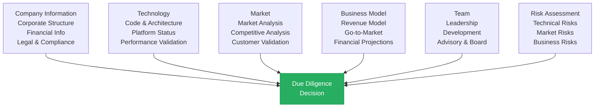

# Mamey Technologies - Due Diligence Checklist

**Version**: 1.0  
**Date**: 2024-12-21  
**Organization**: Mamey Technologies (mamey.io)  
**Audience**: Investors, Strategic Partners  
**Purpose**: Comprehensive due diligence checklist

---

## Overview

This checklist provides a comprehensive guide for conducting due diligence on Mamey Technologies. It covers all aspects of the business, technology, market, and operations to help investors and partners make informed decisions.

**Use This Checklist For**:
- Investment due diligence
- Partnership evaluation
- Strategic decision-making
- Risk assessment

---

## Company Information

### Corporate Structure

- [ ] Corporate entity information
- [ ] Legal structure (LLC, Corp, etc.)
- [ ] Jurisdiction and registration
- [ ] Ownership structure
- [ ] Shareholder information
- [ ] Board composition
- [ ] Corporate governance documents

### Financial Information

- [ ] Financial statements (if available)
- [ ] Revenue history and projections
- [ ] Cost structure and margins
- [ ] Cash flow analysis
- [ ] Funding history
- [ ] Valuation methodology
- [ ] Financial projections

### Legal & Compliance

- [ ] Corporate legal documents
- [ ] Intellectual property (IP) portfolio
- [ ] Patents, trademarks, copyrights
- [ ] License agreements
- [ ] Regulatory compliance status
- [ ] Litigation history
- [ ] Contractual obligations

---

## Technology Due Diligence

### Code & Architecture

- [ ] Codebase review (750,000+ lines total)
  - [ ] MameyNode: 277,000+ lines of Rust code
  - [ ] Banking Libraries: 500,000+ lines of .NET code
- [ ] Architecture documentation
  - [ ] Block Lattice architecture documentation
  - [ ] DPoS consensus mechanism
  - [ ] Master Trust Accounts design
- [ ] Technical specifications
- [ ] Code quality assessment
- [ ] Security audit reports
- [ ] Performance benchmarks
- [ ] Scalability analysis

### Platform Status

- [ ] MameyNode Blockchain (100% core complete)
  - [ ] 35+ modules (19 core + 16 specialized)
  - [ ] 500+ functions implemented
  - [ ] 200+ use cases supported
  - [ ] Block Lattice architecture
  - [ ] Node types: Banking, General, Government
- [ ] Banking Libraries (75-80% complete)
- [ ] Government Services (Production ready)
- [ ] Holistic Medicine (75-80% complete)
- [ ] RedWebNetwork (75-80% complete, Social Media Platform)
- [ ] Portable Nodes (75-80% complete)
- [ ] Pupitre (~65% complete, microservices created, MameyNode integration planned)
- [ ] Casino/MameyCasino (~65% complete, microservices created, MameyNode integration planned)

### Performance Validation

- [ ] Throughput benchmarks
  - [ ] 24,356+ TPS (measured, peak)
  - [ ] 672,380+ TPS (1B users benchmark)
- [ ] Latency measurements
  - [ ] < 50ms (p99)
  - [ ] 0.05ms (P99 measured)
- [ ] Finality times (5.9ms average)
- [ ] Scalability tests (1B+ concurrent users)
- [ ] Stress test results
- [ ] Production deployment data
- [ ] Block Lattice parallel processing validation
- [ ] Multi-currency operation performance

### Security & Compliance

- [ ] Security architecture review
- [ ] Encryption implementation
- [ ] Access control systems
- [ ] Compliance framework
- [ ] Audit logs and monitoring
- [ ] Incident response procedures
- [ ] Security certifications (target)

---

## Market Due Diligence

### Market Analysis

- [ ] Total Addressable Market (TAM): $1.95T
- [ ] Serviceable Addressable Market (SAM): $5B+
- [ ] Serviceable Obtainable Market (SOM): $2-5B ARR
- [ ] Market growth rates
- [ ] Market trends analysis
- [ ] Competitive landscape

### Competitive Analysis

- [ ] Competitive positioning
- [ ] Competitive advantages
- [ ] Market share analysis
- [ ] Competitive threats
- [ ] Differentiation factors
- [ ] Barriers to entry

### Customer Validation

- [ ] Customer pipeline
- [ ] Pilot customers
- [ ] Customer references
- [ ] Market demand validation
- [ ] Customer feedback
- [ ] Use case validation

---

## Business Model Due Diligence

### Revenue Model

- [ ] Revenue streams (5 streams)
- [ ] Pricing models
- [ ] Revenue projections
- [ ] Unit economics
- [ ] Customer acquisition cost (CAC)
- [ ] Lifetime value (LTV)
- [ ] LTV/CAC ratio (10:1 to 50:1)

### Go-to-Market Strategy

- [ ] Market entry strategy
- [ ] Sales strategy
- [ ] Marketing strategy
- [ ] Partnership strategy
- [ ] Channel strategy
- [ ] Customer acquisition plan

### Financial Projections

- [ ] Year 1-2: $50-200M ARR
- [ ] Year 3-5: $500M-2B ARR
- [ ] Year 5+: $2-5B ARR
- [ ] Gross margins: 75-85%
- [ ] Operating margins: 20-50%
- [ ] Cash flow projections
- [ ] Break-even analysis

---

## Team Due Diligence

### Leadership Team

- [ ] Executive team backgrounds
- [ ] Relevant experience
- [ ] Track record
- [ ] References
- [ ] Compensation structure
- [ ] Equity ownership

### Development Team

- [ ] Team size and structure
- [ ] Technical expertise
- [ ] Development track record
- [ ] Code contribution history
- [ ] Team retention
- [ ] Hiring plan

### Advisory & Board

- [ ] Advisory board members
- [ ] Board of directors
- [ ] Industry expertise
- [ ] Strategic value
- [ ] Network and connections

---

## Partnership Due Diligence

### Strategic Partnerships

- [ ] Futurehead Group partnership
- [ ] S&K Holding QT partnership
- [ ] Partnership agreements
- [ ] Partnership value
- [ ] Partnership risks

### Technology Partnerships

- [ ] Technology partner relationships
- [ ] Integration partnerships
- [ ] Co-development agreements
- [ ] Technology dependencies

---

## Risk Assessment

### Technical Risks

- [ ] Technology risks
- [ ] Scalability risks
- [ ] Security risks
- [ ] Performance risks
- [ ] Integration risks
- [ ] Mitigation strategies

### Market Risks

- [ ] Market adoption risks
- [ ] Competitive risks
- [ ] Regulatory risks
- [ ] Economic risks
- [ ] Mitigation strategies

### Business Risks

- [ ] Execution risks
- [ ] Financial risks
- [ ] Operational risks
- [ ] Partnership risks
- [ ] Mitigation strategies

---

## Documentation Review

### Available Documentation

- [ ] Investment Memorandum
- [ ] Executive Summary
- [ ] Technical Documentation
- [ ] Financial Projections
- [ ] Market Analysis
- [ ] Competitive Analysis
- [ ] Use Case Catalog
- [ ] Case Studies
- [ ] Compliance Documentation
- [ ] Security Documentation

---

## Reference Checks

### Customer References

- [ ] Pilot customer references
- [ ] Customer testimonials
- [ ] Case studies
- [ ] Customer satisfaction data

### Partner References

- [ ] Partner references
- [ ] Partnership success stories
- [ ] Partner testimonials

### Industry References

- [ ] Industry expert opinions
- [ ] Analyst reports
- [ ] Industry recognition
- [ ] Awards and accolades

---

## Site Visits & Demos

### Technical Demo

- [ ] Live platform demonstration
- [ ] Performance demonstration
- [ ] Feature walkthrough
- [ ] Integration demonstration

### Site Visit

- [ ] Office visit (if applicable)
- [ ] Development team meeting
- [ ] Infrastructure review
- [ ] Operations review

---

## Legal & Regulatory Review

### Legal Review

- [ ] Corporate legal structure
- [ ] IP ownership and protection
- [ ] Contract review
- [ ] Liability assessment
- [ ] Regulatory compliance

### Regulatory Review

- [ ] Banking regulations
- [ ] Government regulations
- [ ] Healthcare regulations
- [ ] Data privacy regulations
- [ ] International regulations

---

## Financial Due Diligence

### Financial Review

- [ ] Financial statements
- [ ] Revenue recognition
- [ ] Cost structure
- [ ] Cash flow analysis
- [ ] Working capital
- [ ] Debt and liabilities

### Valuation Analysis

- [ ] Valuation methodology
- [ ] Comparable company analysis
- [ ] Precedent transaction analysis
- [ ] Discounted cash flow (DCF)
- [ ] Risk-adjusted valuation

---

## Technology Deep Dive

### Code Review

- [ ] Source code access
- [ ] Code quality assessment
- [ ] Architecture review
- [ ] Security code review
- [ ] Performance optimization review

### Infrastructure Review

- [ ] Infrastructure architecture
- [ ] Deployment architecture
- [ ] Scalability architecture
- [ ] Security architecture
- [ ] Disaster recovery

---

## Market Validation

### Market Research

- [ ] Market size validation
- [ ] Market growth validation
- [ ] Customer demand validation
- [ ] Competitive analysis validation
- [ ] Pricing validation

### Customer Validation

- [ ] Customer interviews
- [ ] Customer surveys
- [ ] Market research
- [ ] Demand validation
- [ ] Willingness to pay

---

## Competitive Analysis

### Competitive Review

- [ ] Competitive landscape
- [ ] Competitive positioning
- [ ] Competitive advantages
- [ ] Competitive threats
- [ ] Market share analysis

### Differentiation

- [ ] Unique value proposition
- [ ] Competitive moats
- [ ] Barriers to entry
- [ ] Sustainable advantages

---

## Exit Strategy

### Exit Options

- [ ] Strategic acquisition potential
- [ ] IPO potential
- [ ] Secondary sale potential
- [ ] Exit timeline
- [ ] Exit valuation potential

---

## Due Diligence Timeline

### Typical Timeline

**Week 1-2**: Initial review and documentation
- [ ] Document review
- [ ] Initial questions
- [ ] Information requests

**Week 3-4**: Deep dive
- [ ] Technical review
- [ ] Financial review
- [ ] Market validation
- [ ] Reference checks

**Week 5-6**: Analysis and decision
- [ ] Risk assessment
- [ ] Valuation analysis
- [ ] Decision making
- [ ] Negotiation

---

## Due Diligence Team

### Recommended Team

- [ ] Investment analyst
- [ ] Technical expert
- [ ] Financial analyst
- [ ] Legal counsel
- [ ] Market researcher
- [ ] Industry expert

---

## Key Questions to Answer

### Strategic Questions

1. Is this a good investment/partnership opportunity?
2. What are the key risks and how are they mitigated?
3. What is the realistic valuation?
4. What is the exit potential?
5. What are the key success factors?

### Technical Questions

1. Is the technology production-ready?
2. Can it scale to meet projections?
3. Is it secure and compliant?
4. What are the technical risks?
5. What is the competitive advantage?

### Market Questions

1. Is the market opportunity real?
2. Can we capture the projected market share?
3. What is the competitive landscape?
4. What are the market risks?
5. What is the go-to-market strategy?

---

## Contact

**Due Diligence Support**:  
Email: duediligence@mamey.io  
Documentation: docs.mamey.io  
Schedule: Schedule due diligence sessions

---

**Mamey Technologies** - Building better financial infrastructure for the sovereign era

*Use this checklist to ensure comprehensive due diligence. For specific questions, contact the due diligence team.*

